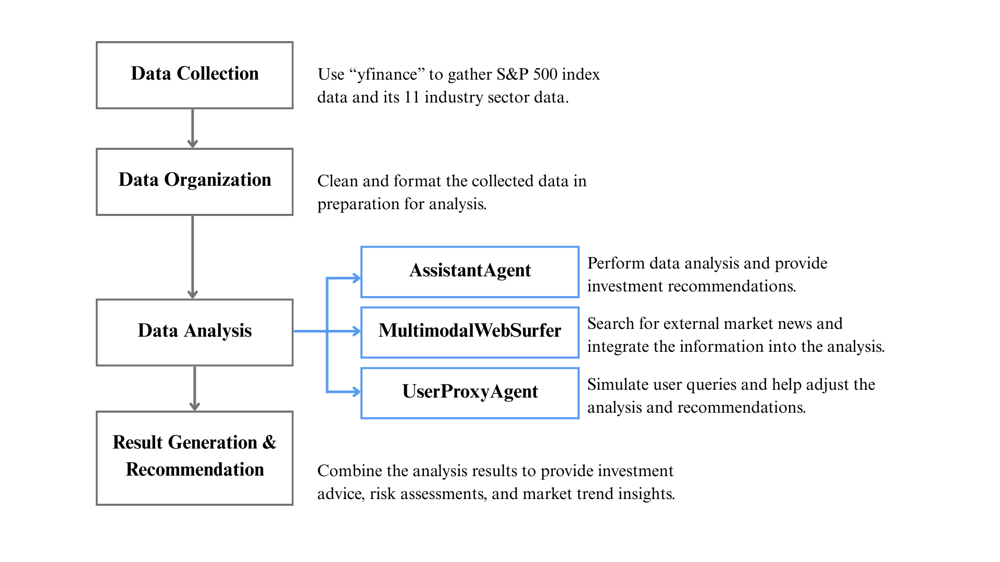

# Data Structure
* 姓名：黃靖媛
* 授課教師: 蔡芸琤老師

## Homework
### HW1
* [Coding](Autogen_Project/HW1/dataAgent_US_Market.py)
* [Video](https://youtu.be/ZU6N17cdLlE?si=2tqZHwpTqimzu4MO)

Analyzing the past three years of the U.S. stock market using AI agents to conduct macroeconomic and industry analysis, generate investment portfolio recommendations, and assess associated risks.

### HW2
* [Coding](DRai/HW2/Drai_Academic_Discussion.py)

### HW3
* [Coding](Playwright/HW3/Todolist_AI.py)

### HW4
* [Coding](getPDF/HW4/getPDF_DRai.py)
* [PDF result](getPDF/HW4/DRai_result_PDF.pdf)

### HW5
* [Coding](EMO/HW5/app.py)

***

## Final Project--Multi-Agent System for Stock Analysis
This project implements a multi-agent system for comprehensive financial analysis of stocks. It combines stock data analysis, market sentiment analysis, and automated report generation, which is then sent via email. The system uses Gemini-2.0 and includes five AI agents working together.
* [第一次審查影片](https://youtu.be/1bVJAloY4fM)
* [第二次進度追蹤](https://youtu.be/wONMbGkUn_I)

### Features
* Real-time stock data analysis using Yahoo Finance
* Stock price visualization with charts
* Web search integration for the latest company information and market sentiment
* Investment suggestions
* Automated report generation and email distribution

### Flow chart

